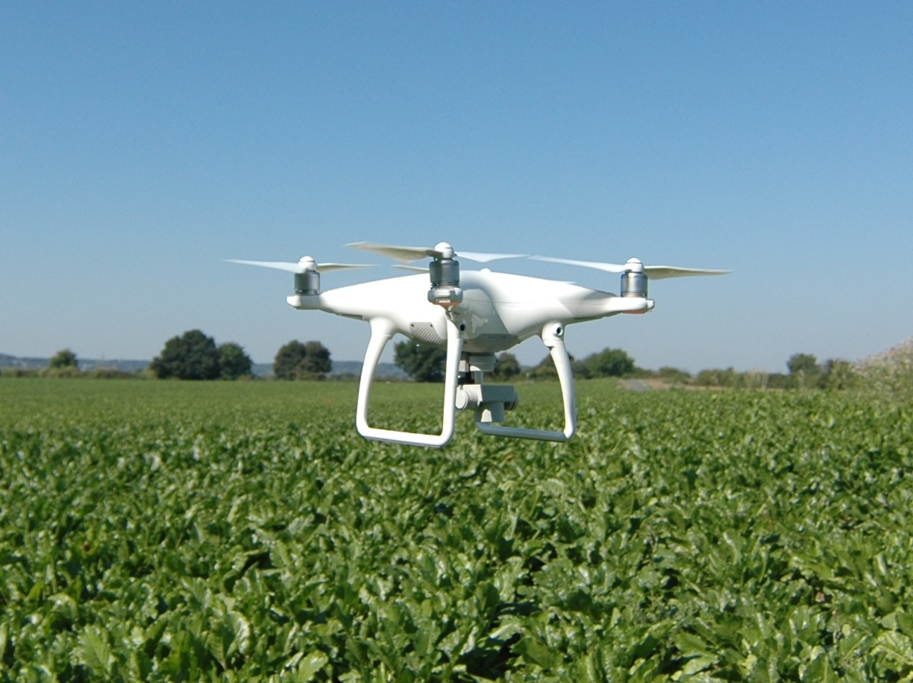

# Adaptive and Scalable Edge‑Based Weed Classification through Distilled Mixture‑of‑Experts and Metric Learning

🚀 **Availability of Supplementary Materials:** 
All supplementary materials for this work, including Appendix and online reproducibility package: (code, models, and instructions) are available from the authors upon reasonable request.
